# Nexo

[^1]: Imagem gerada pela aplicação Pletor.Ai
##### Ligacão entre a Mente e o Movimento 

## Conceito

**(PT)** Este projeto consiste numa série de discos modulares impressos em 3D concebidos para ajudar na gestão do stress e da ansiedade através da estimulação tátil. A peça convida o utilizador a interagir constantemente com os dedos, explorando movimentos de rotação, pressão e manipulação que ajudam a direcionar a energia nervosa para uma ação física simples e repetitiva.

A inspiração surge da observação de comportamentos comuns em situações de ansiedade, como mexer nas mãos, rodar objetos ou procurar estímulos táteis. Em vez de reprimir esses impulsos, o objeto transforma-os numa ferramenta de autorregulação, proporcionando uma experiência sensorial discreta e acessível.

O design circular simboliza continuidade, equilíbrio e fluidez, enquanto a dimensão reduzida permite que o objeto acompanhe o utilizador em diferentes contextos do dia a dia. A interação repetitiva promove momentos de foco e presença, ajudando a reduzir a sensação de sobrecarga mental e a criar uma pausa no ritmo acelerado do quotidiano.

**(ENG)** This project consists of a series of modular 3D-printed discs designed to help manage stress and anxiety through tactile stimulation. The object encourages continuous interaction with the fingers, allowing users to explore movements such as rotating, pressing, and manipulating the discs. These repetitive actions help redirect nervous energy into a simple and controlled physical activity.

The concept was inspired by common behaviors associated with anxiety, such as fidgeting with hands, spinning objects, or seeking tactile stimulation. Rather than suppressing these impulses, the design transforms them into a self-regulation tool, providing a discreet and accessible sensory experience.

The circular form symbolizes continuity, balance, and fluidity, while its compact size allows the object to be carried and used in a variety of everyday situations. Through repetitive interaction, it promotes moments of focus and mindfulness, helping to reduce feelings of mental overload and create a pause within the fast pace of daily life.
## Tecnologias Usadas

Uma ou mais tecnologias estudadas em laboratório:

- [ ] Corte 2D (laser / vinil)
- [x] Impressão 3D
- [ ] CNC
- [ ] Micro:bit / computação física
- [ ] Outras —

Materiais, software, ficheiros técnicos.

##
Processo
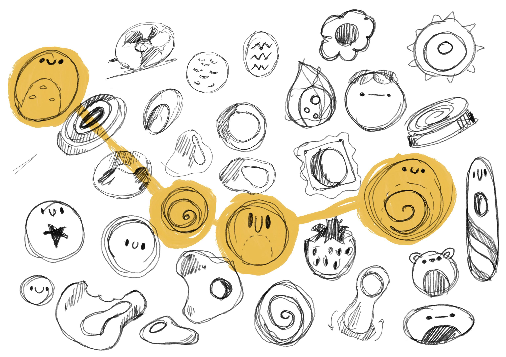
> ###### Exploração da Forma/exploration of form

### **Processo :** 
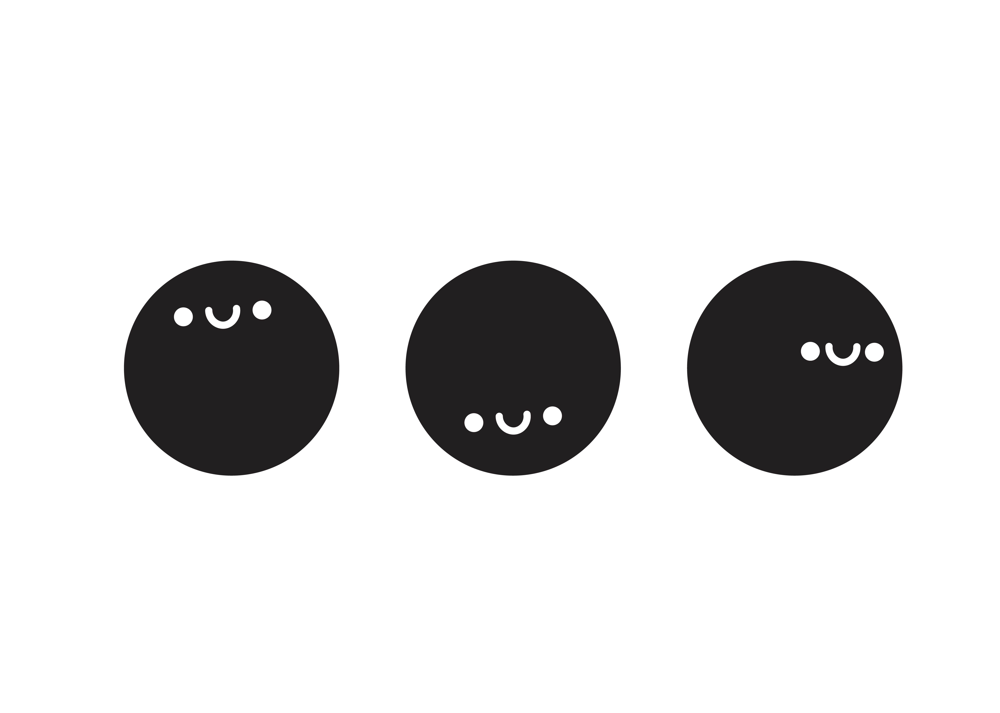
1) No Adobe Illustator elaborei 3 “Carinhas” que serviram de base para o meu objeto.
 (**ENG**) In Adobe Illustrator, I created 3 "faces" that served as the basis for my object.
 
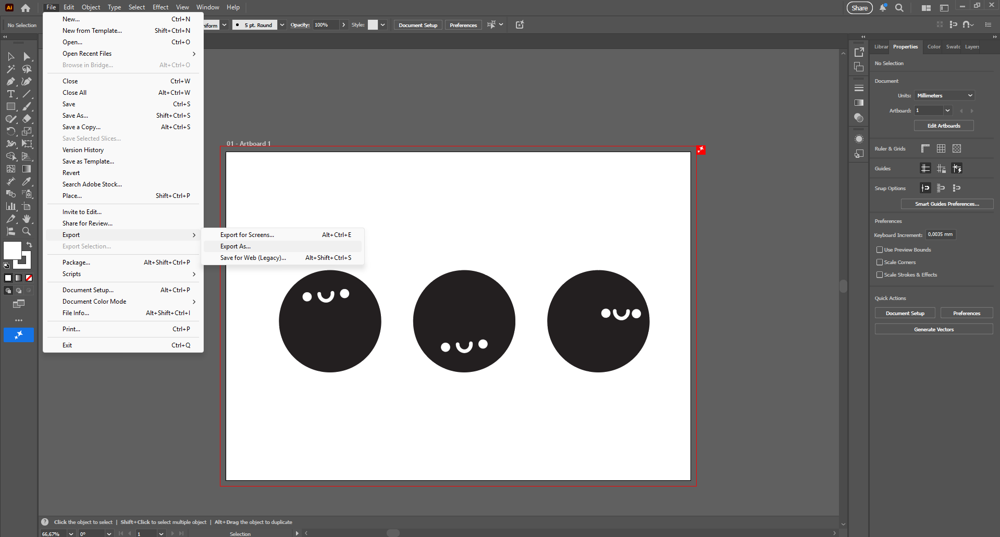
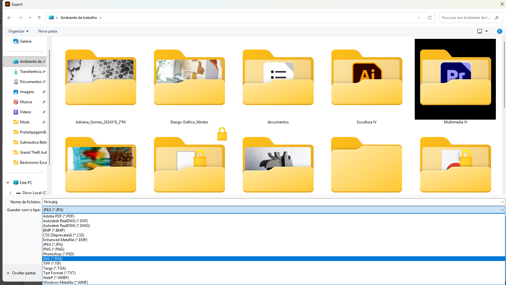
2) Exportei o Ficheiro em SVG para o poder abrir no Fusion 360 e começar a modelar as formas de acordo o desenho final.
 (**ENG**)  I exported the file as an SVG so I could open it in Fusion 360 and start modeling the shapes according to the final design.
 
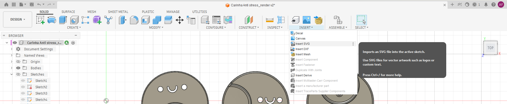

3) Abri o Ficheiro SVG anteriormente salvo e comecei a modelar de acordo o meu desenho, adicionar texturas, arredondar os cantos etc.
 (**ENG**) I opened the previously saved SVG file and began modeling according to my drawing, adding textures, rounding the corners, etc. 

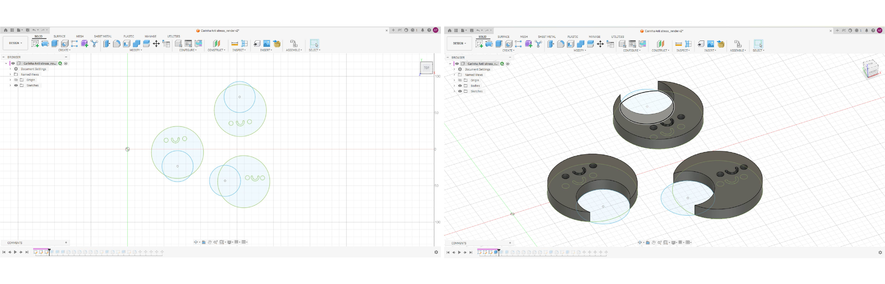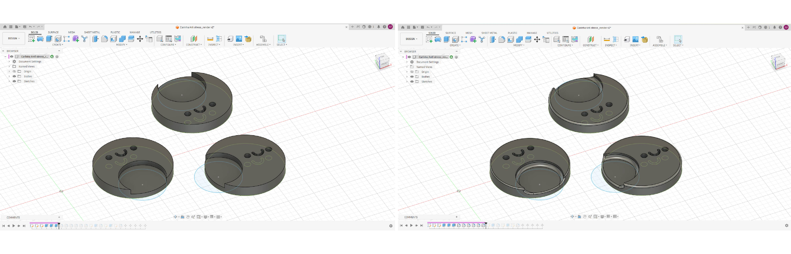
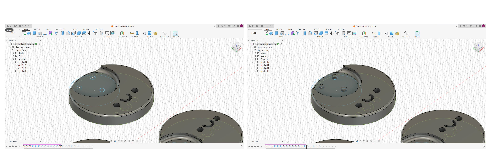
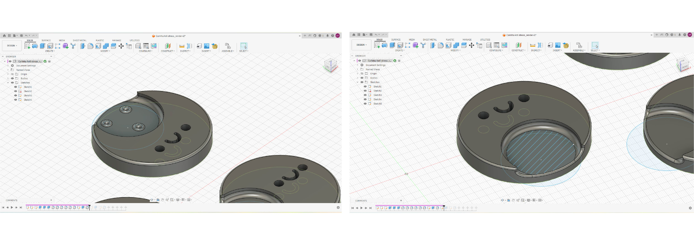
4) Já no Fusion, consegui configurar a espessura e tamanho do meu objeto, acrescentar as texturas, e arredondar as cantos.
 (**ENG**) In Fusion, I was able to configure the thickness and size of my object, add textures, and round the corners.

**Link Do Fusion**  [https://a360.co/4e9oZ0l](https://a360.co/4e9oZ0l)
###### 

Vistas Ortogonais 
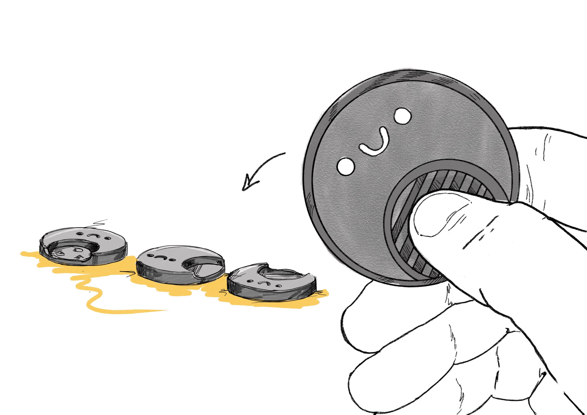
### Iteração 1 — [Processso + Objeto Finalizado]

**O que aprendi:*** 
Durante a disciplina de Prototipagem aprendi a desenvolver e testar ideias através da criação de protótipos, utilizando ferramentas de modelação e impressão 3D. Compreendi a importância da experimentação, da resolução de problemas e da melhoria contínua para alcançar um produto funcional e adequado às necessidades do utilizador. Esta experiência permitiu-me adquirir competências técnicas e uma melhor compreensão do processo de desenvolvimento de produto.

**(ENG)** During the Prototyping course, I learned to develop and test ideas by creating prototypes using 3D modeling and printing tools. I understood the importance of experimentation, problem-solving, and continuous improvement to achieve a functional product that meets user needs. This experience allowed me to acquire technical skills and a better understanding of the product development process.

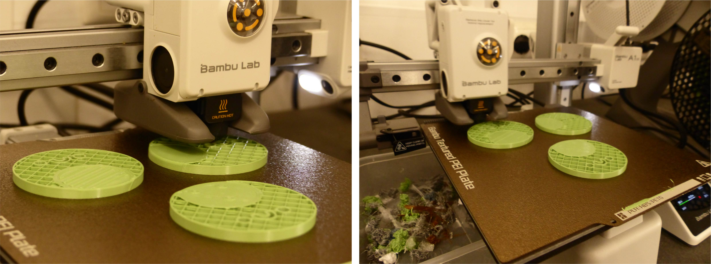

## Resultado Final

Imagens bem produzidas do produto/objeto/intervenção final, com texto explicativo.

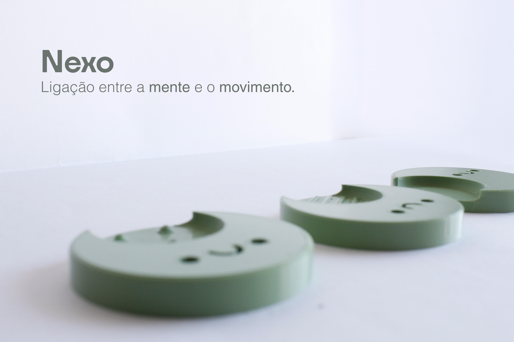
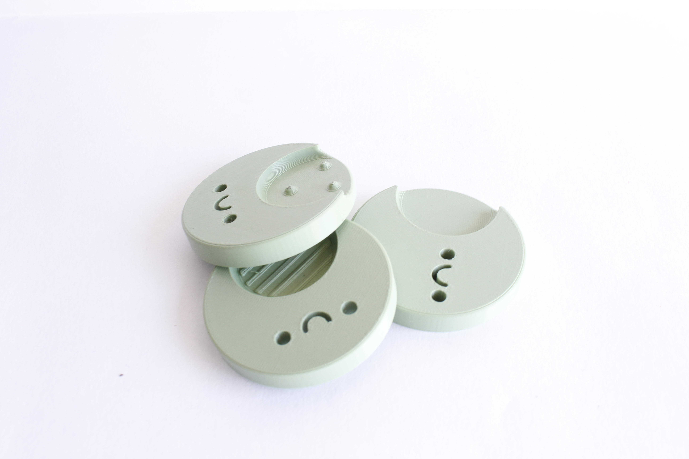
Este projeto consiste em discos modulares impressos em 3D para gestão do stress e ansiedade através do toque. O objeto convida à interação constante com os dedos  rotação, pressão, manipulação transformando impulsos nervosos comuns (mexer nas mãos, rodar objetos) numa ferramenta de autorregulação tátil. O design circular remete para equilíbrio e continuidade, e o tamanho reduzido torna-o discreto e portátil. A interação repetitiva promove foco e presença, criando pausas mentais no dia a dia.

**(ENG)** This project consists of 3D-printed modular discs for stress and anxiety management through touch. The object invites constant interaction with the fingers – rotation, pressure, manipulation – transforming common nerve impulses (fidgeting, rotating objects) into a tool for tactile self-regulation. The circular design suggests balance and continuity, and its small size makes it discreet and portable. Repetitive interaction promotes focus and presence, creating mental pauses in daily life.
## Reflexão
O que faria diferente? Que tecnologia exploraria mais a fundo numa próxima iteração?
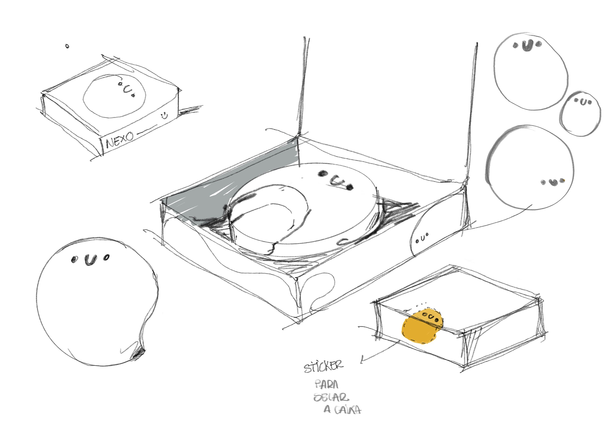**(PT)** Numa próxima iteração, aproveitaria a máquina **Silhouette** para complementar o projeto de uma forma que não foi possível concretizar nesta fase. A ideia seria criar uma embalagem para o objeto, selada com um **sticker personalizado** produzido na Silhouette.
Este elemento de packaging acrescentaria uma dimensão importante ao projeto, transformando não só o objeto em si, mas também a experiência de o receber e abrir. Um sticker com o logótipo ou um elemento gráfico do projeto funcionaria como selo de identidade, tornando a embalagem mais cuidada, coesa e intencional.

**(ENG)**  In a future iteration, I would use the Silhouette machine to complement the project in a way that wasn't possible to achieve at this stage. The idea would be to create a packaging box for the object, sealed with a custom sticker produced on the Silhouette.
This packaging element would add an important dimension to the project, transforming not only the object itself, but also the experience of receiving and opening it. A sticker with the logo or a graphic element of the project would act as an identity seal, making the packaging more carefully crafted, cohesive, and intentional.
