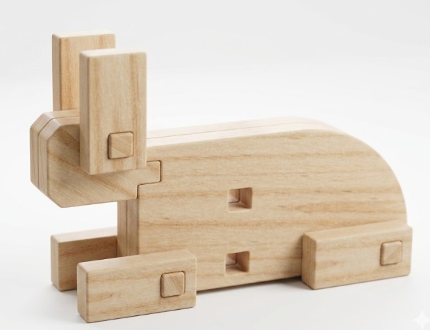
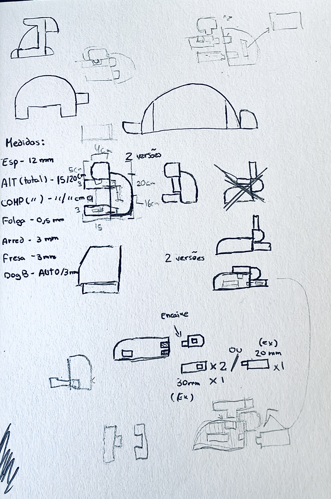
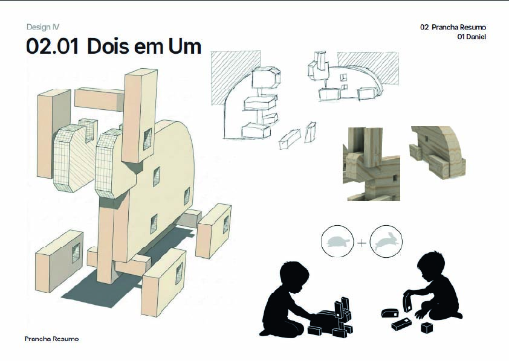
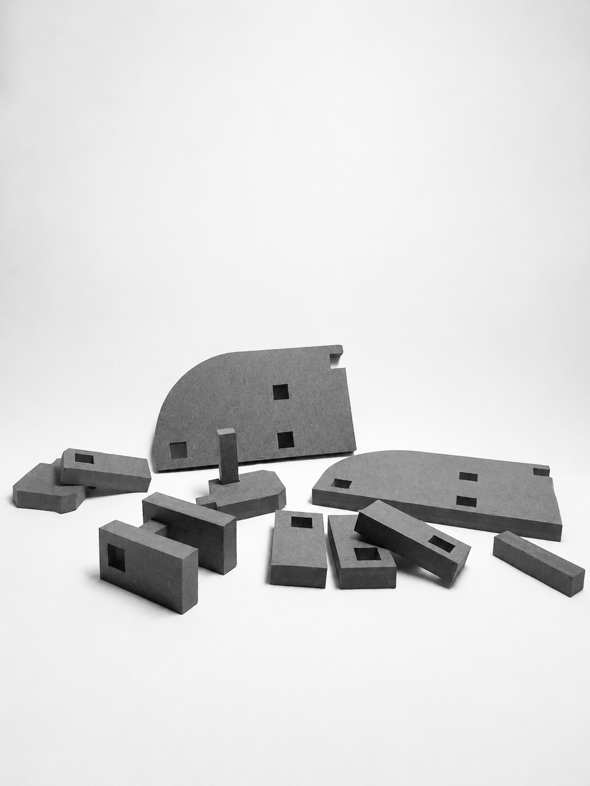

# Dois em Um

Frase-conceito:  Duas personagens, um conjunto de peças e inúmeras formas de criar. (O projeto foi criado no âmbito da unidade curricular de design de produto)

## Conceito

(PT)

Inspirado na fábula _A Lebre e a Tartaruga_, este brinquedo modular em madeira explora os conceitos de diversidade, transformação e criatividade através da construção. O conjunto é composto por peças de encaixe que permitem montar tanto a lebre como a tartaruga, assim como inúmeras variações formais entre ambas.

A proposta incentiva a criança a reinterpretar as personagens da história, compreendendo que diferentes elementos podem dar origem a múltiplas soluções. Através da montagem e desmontagem das peças, desenvolvem-se competências motoras, perceção espacial e pensamento construtivo, promovendo simultaneamente uma aprendizagem lúdica baseada na experimentação.

A combinação entre formas geométricas simples e referências figurativas cria um objeto que une narrativa, jogo e exploração, transformando uma fábula clássica numa experiência interativa e educativa.

(ENG)

Inspired by the fable _The Hare and the Tortoise_, this modular wooden toy explores the concepts of diversity, transformation, and creativity through construction. The set consists of interlocking pieces that can be assembled to create either the hare or the tortoise, as well as countless formal variations of both.

The design encourages children to reinterpret the characters from the story, understanding how different elements can generate multiple solutions. Through assembling and disassembling the pieces, children develop motor skills, spatial awareness, and constructive thinking, while engaging in a playful learning experience based on experimentation.

The combination of simple geometric forms and figurative references creates an object that brings together storytelling, play, and exploration, transforming a classic fable into an interactive and educational experience.
## Tecnologias Usadas

Uma ou mais tecnologias estudadas em laboratório:

- [ ] Corte 2D (laser / vinil)
- [ ] Impressão 3D
- [x] CNC
- [ ] Micro:bit / computação física
- [ ] Outras —

Materiais, software, ficheiros técnicos.

Link ficheiro Fusion 360 : https://a360.co/4wZUHnW
## Processo

Iterações, decisões, aprendizagens. Mostra o percurso, não só o resultado.

### Iteração 1

**O que tentei:** Vários locais para os encaixes até chegar aos ideais.
**O que aprendi:** Novas formas de parametrização.

## Resultado Final

O resultado final deste projeto materializa-se num brinquedo modular de encaixe, integralmente desenvolvido em derivados de madeira. Inspirado na clássica fábula "A Lebre e a Tartaruga", o design explora a fundo os conceitos de transformação, dualidade e ritmo através de formas geométricas minimalistas e funcionais. A essência do projeto reside na reinterpretação abstrata da narrativa, afastando-se de uma representação literal para sintetizar os animais nas suas linhas de força mais marcantes. Assim, a lebre ganha vida através de uma composição vertical e angular que transmite agilidade e prontidão, enquanto o mesmo conjunto de peças, quando reorganizado, encerra o potencial para dar lugar à silhueta horizontal, estável e compacta da tartaruga.

The final outcome of this project materializes as a modular interlocking toy, fully developed from wood derivatives. Inspired by the classic fable 'The Tortoise and the Hare', the design thoroughly explores the concepts of transformation, duality, and rhythm through minimalist and functional geometric shapes. The essence of the project lies in the abstract reinterpretation of the narrative, moving away from a literal representation to synthesize the animals into their most striking lines of force. Thus, the hare comes to life through a vertical and angular composition that conveys agility and alertness, while the very same set of pieces, when reorganized, holds the potential to give rise to the horizontal, stable, and compact silhouette of the tortoise.
## Reflexão

Podia ter explorado mais profundamente diferentes formas de encaixe, não apenas como solução funcional, mas também como uma oportunidade para investigar variações formais e estruturais. Teria sido útil desenvolver mais testes experimentais, de modo a experimentar diferentes geometrias, tolerâncias e sistemas de ligação entre peças, permitindo perceber melhor como pequenas alterações influenciam o resultado final.

Ao mesmo tempo, faria sentido ter usado mais a impressão 3D como ferramenta de experimentação. Para além de servir para produzir peças finais, poderia ter sido usada sobretudo para testar ideias de forma rápida e iterativa, fazendo várias versões com pequenas diferenças. Isso teria ajudado a perceber melhor o comportamento dos encaixes, a resistência das ligações e a relação entre o desenho digital e o objeto físico.
