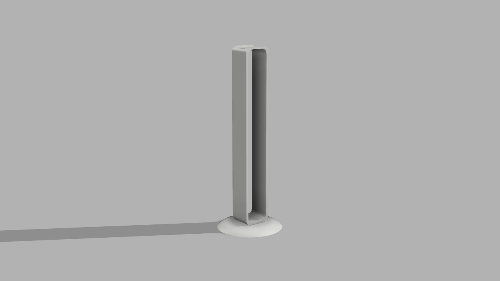

# Suporte de Headphones

Imagem de Referencia

## Conceito

O objetivo deste projeto foi criar um suporte para fones de ouvido através da modelação e impressão em 3D. A ideia consistiu em desenvolver um suporte de headphone funcional que pudesse ser utilizado no dia a dia, explorando ao mesmo tempo as ferramentas de modelação e o processo de fabricação digital.

## Tecnologias Usadas

Uma ou mais tecnologias estudadas em laboratório:

- [ ] Corte 2D (laser / vinil)
- [x] Impressão 3D
- [ ] CNC
- [ ] Micro:bit / computação física
- [ ] Outras —

- Impressora Bambu Lab A1 Mini
- Material: PLA fornecido pela escola
- Software: Fusion360 (modelação) e Bambu Studio (para preparação da impressão)

## Processo

O modelo foi desenvolvido no Fusion 360, onde foram definidas as proporções e a forma geral do suporte. A estrutura inclui uma base circular para maior estabilidade e um elemento vertical com encaixe para segurar os fones.

A primeira versão revelou-se inadequada, tendo sido necessário rever o modelo e realizar uma segunda iteração com ajustes que permitiram obter um resultado funcional. Esta segunda versão foi a que chegou à fase de impressão, sendo a que foi produzida na impressora.

### Iteração 1 — Protótipo inicial

O que tentei: Desenvolver um suporte com um design mais orgânico, com base retangular, braço curvo e um encaixe na parte inferior para conectar a parte superior com a inferior

O que aprendi: O encaixe projetado era simples porem não era adequado para o PLA, uma vez que o material não possui flexibilidade suficiente para permitir o encaixe sem risco de quebra. Para além disso, corrigir este problema obrigaria a reformular o modelo na totalidade, pelo que optei por recomeçar com uma abordagem diferente.

Render do projeto

### Iteração 2 — Versão final

O que tentei: Simplificar o design, adotando uma base circular para maior estabilidade e um elemento vertical em forma de U onde os fones assentam pela banda superior, eliminando a necessidade de qualquer encaixe complexo.

O que aprendi: A simplicidade de um modelo pode cria uma vantagem significativa, especialmente quando as propriedades do material são limitados. Uma solução mais direta resultou numa peça mais fácil de imprimir e igualmente funcional.

Render do projeto

## Resultado Final

O modelo foi impresso na Bambu Lab. A1 Mini, obtendo uma peça funcional e com boa qualidade de acabamento. Optei por não realizar qualquer intervenção de acabamento, mantive a peça no seu estado original tal como saiu da impressora, o que permite observar diretamente a qualidade e as características do processo de impressão 3D. Porem durante o transporte de forma inadequada acabou que a peça ficou danificada.

## Reflexão

Numa próxima iteração, começaria por analisar melhor as limitações dos materiais disponíveis no fablab antes de definir a forma e o tamanho do modelo. Gostaria também de explorar mais aprofundadamente outros materiais e outras maquinas de impressora 3D, tirando partido das suas ferramentas de simulação através do programa para prever possíveis falhas antes de avançar para a impressão.