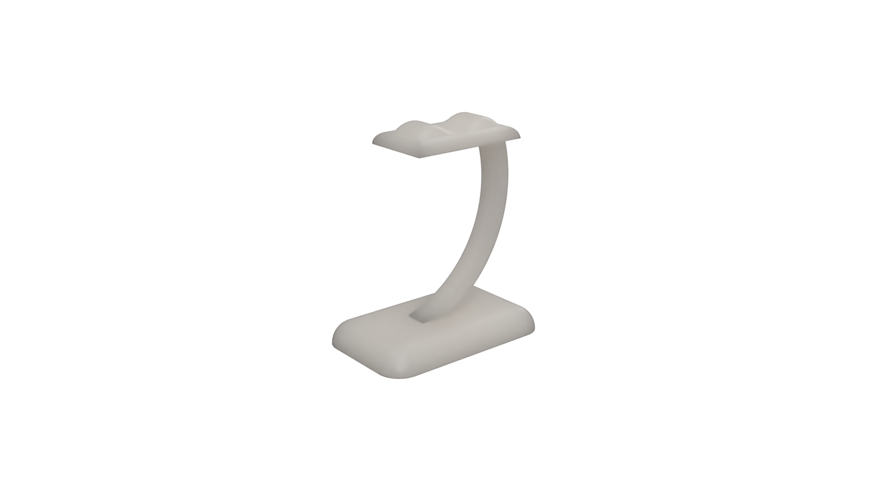

# Suporte de Headphones

Imagem de Referencia

## Conceito

**PT**- O objetivo deste projeto foi criar um suporte para fones de ouvido através da modelação e impressão em 3D. A ideia consistiu em desenvolver um suporte de headphone funcional que pudesse ser utilizado no dia a dia, explorando ao mesmo tempo as ferramentas de modelação e o processo de fabricação digital.

**ENG**- The goal of this project was to create a headphone stand using 3D modeling and printing. The idea was to develop a functional headphone stand that could be used daily, while simultaneously exploring modeling tools and the digital manufacturing process.

## Tecnologias Usadas

Uma ou mais tecnologias estudadas em laboratório:

- [ ] Corte 2D (laser / vinil)
- [x] Impressão 3D
- [ ] CNC
- [ ] Micro:bit / computação física
- [ ] Outras —

**PT** - Impressora Bambu Lab A1 Mini
- Material: PLA fornecido pela escola
- Software: Fusion360 (modelação) e Bambu Studio (para preparação da impressão)

**ENG-** Bambu Lab A1 Mini Printer
- Material: PLA provided by the school
- Software: Fusion360 (modeling) and Bambu Studio (for print preparation)

## Processo

**PT**- O modelo foi desenvolvido no Fusion 360, onde foram definidas as proporções e a forma geral do suporte. A estrutura inclui uma base circular para maior estabilidade e um elemento vertical com encaixe para segurar os fones.

A primeira versão revelou-se inadequada, tendo sido necessário rever o modelo e realizar uma segunda iteração com ajustes que permitiram obter um resultado funcional. Esta segunda versão foi a que chegou à fase de impressão, sendo a que foi produzida na impressora.

**ENG**-  The model was developed in Fusion 360, where the proportions and overall shape of the stand were defined. The structure includes a circular base for greater stability and a vertical element with a slot to hold the earphones.

The first version proved inadequate, requiring a revision of the model and a second iteration with adjustments that allowed for a functional result. This second version was the one that reached the printing stage and was produced on the printer.

### Iteração 1 — Protótipo inicial

**PT**- O que tentei: Desenvolver um suporte com um design mais orgânico, com base retangular, braço curvo e um encaixe na parte inferior para conectar a parte superior com a inferior

O que aprendi: O encaixe projetado era simples porem não era adequado para o PLA, uma vez que o material não possui flexibilidade suficiente para permitir o encaixe sem risco de quebra. Para além disso, corrigir este problema obrigaria a reformular o modelo na totalidade, pelo que optei por recomeçar com uma abordagem diferente.

**ENG**- What I tried: To develop a stand with a more organic design, with a rectangular base, curved arm, and a fitting at the bottom to connect the top and bottom parts.

What I learned: The designed fitting was simple but not suitable for PLA, as the material does not have enough flexibility to allow for a secure fit without risk of breakage. Furthermore, correcting this problem would require completely redesigning the model, so I opted to start over with a different approach.

Render do projeto

### Iteração 2 — Versão final

**PT**- O que tentei: Simplificar o design, adotando uma base circular para maior estabilidade e um elemento vertical em forma de U onde os fones assentam pela banda superior, eliminando a necessidade de qualquer encaixe complexo.

O que aprendi: A simplicidade de um modelo pode cria uma vantagem significativa, especialmente quando as propriedades do material são limitados. Uma solução mais direta resultou numa peça mais fácil de imprimir e igualmente funcional.

**ENG**- What I tried: Simplify the design by adopting a circular base for greater stability and a vertical U-shaped element where the earphones sit by the top band, eliminating the need for any complex fitting.

What I learned: The simplicity of a model can create a significant advantage, especially when material properties are limited. A more straightforward solution resulted in a part that was easier to print and equally functional.

Render do projeto

## Resultado Final

**PT**- O modelo foi impresso na Bambu Lab. A1 Mini, obtendo uma peça funcional e com boa qualidade de acabamento. Optei por não realizar qualquer intervenção de acabamento, mantive a peça no seu estado original tal como saiu da impressora, o que permite observar diretamente a qualidade e as características do processo de impressão 3D. Porem durante o transporte de forma inadequada acabou que a peça ficou danificada.

**ENG**- The model was printed on a Bambu Lab A1 Mini, resulting in a functional piece with good finish quality. I chose not to perform any finishing work, keeping the piece in its original state as it came out of the printer, which allows direct observation of the quality and characteristics of the 3D printing process. However, during improper transport, the piece ended up being damaged.

## Reflexão

**PT**- Numa próxima iteração, começaria por analisar melhor as limitações dos materiais disponíveis no fablab antes de definir a forma e o tamanho do modelo. Gostaria também de explorar mais aprofundadamente outros materiais e outras maquinas de impressora 3D, tirando partido das suas ferramentas de simulação através do programa para prever possíveis falhas antes de avançar para a impressão.

**ENG**-   
In a future iteration, I would begin by more thoroughly analyzing the limitations of the materials available in the fablab before defining the shape and size of the model. I would also like to explore other materials and other 3D printer machines in more depth, taking advantage of their simulation tools through the program to predict possible failures before proceeding to printing.
