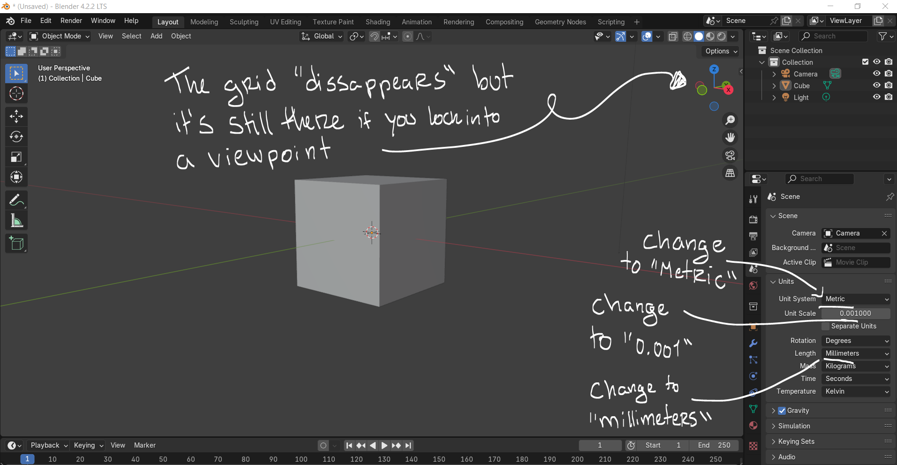

# Birdie Vase

Criar um vaso de plantas em forma de passarinho. / Create a bird shaped flower pot.

## Conceito / Concept

Este projeto consiste no desenvolvimento de um vaso impresso a 3D inspirado na forma de uma ave, criando um objeto simultaneamente funcional e decorativo. O objetivo principal foi explorar as possibilidades de forma da impressora 3D e das minhas capacidades de modelação em 3D.

A proposta não surgiu de um problema específico mas pela intenção de investigar a relação entre a estética, volume e identidade visual do objeto e a sua utilização como vaso.

## Tecnologias Usadas

Uma ou mais tecnologias estudadas em laboratório:

- [ ] Corte 2D (laser / vinil)
- [x] Impressão 3D
- [ ] CNC
- [ ] Micro:bit / computação física
- [ ] Outras —

**Software e Material Utilizado:

- Krita (esboços)
- Blender (modelação 3D)
- Bambu Studio
- Bambu Lab A1 mini

**Ficheiros:**

## Processo

**PT** - Comecei por esboçar o que pretendia num ficheiro de Krita, o primeiro conceito da forma e do seu propósito. Depois, refinei o formato do vaso e desenhei em vários ângulos para utilizar como referência na modelagem 3D.

**EN** - I started by doing a rough sketch of what i intended to do in a Krita file, the first shape concept and how the object would be utilized. Then, I refined the shape of the vase and drew multiple angles so I could used them in the 3D modelling.

**PT** - Primeiro, tive que configurar o documento para que as medidas fiquem compatíveis com o software de impressão 3D. Para isso, nas definições do Scene mudei o sistema de medida para "Metric", a medida da escala para "Milímetros" e a escala das unidades para "0.001". Isto para que as medidas sejam precisas e corretas para o software.

**EN** - First, I had to configure the document so that the measurments are compatible with the 3D printing software. For that, in the Scene settings I changed the measurment system to "Metric", the scale to "Millimeters" and the unit scale to "0.001". This makes it so the measurments are precise and accurate for the software.

**PT** - Adicionei as referências no blender com o Shift + A ou Add -> Referência para adicionar os esboços em todos os ângulos.

**EN** - I added the references to blender with Shift + A or Add -> Reference to add the sketches from every angle.

Shift + A -> Mesh -> Circle -> X 70mm, Y 70mm

**PT** - Alinhei o círculo com as referências no Object mode, e dentro do Edit Mode, Shift + D para duplicar e adicionar mais círculos, delineando o volume do objeto.

**EN** - I lined up the circle with the references in Object Mode, then inside Edit Mode, Shift + D to duplicate and add more circles, outlining the volume of the object.

**PT** - Apaguei a metade dos círculos com Del -> Edges e adicionei o modifier de "Mirror" a espelhar o eixo do X.

**EN** - Deleted the half of the circles with Del -> Edges and added the "Mirror" Modifier and set it to mirror the X axis.

**PT** - Selecionei os círculos a pares e utilizei o Bridge do add-on das LoopTools (Loft também dá).
Repeti até a forma estar completa.

**EN** - I selected the circles in pairs and used the Bridge option in the LoopTools add-on (Loft also works).
I repeated the process until the shape was complete.

**PT** - Extrude x5 para fazer o bico e repetir com a cauda.
A primeira extrusão é muito pequena apenas para vincar o bico.

**EN** - Extrude 5x to shape the beak and repeat with the tail.
The first extrusion is very small and only to crease the beak.

**PT** - Adicionei mais vincos com o "Mark sharp" onde as dobras serão mais definidas para destacar as asas.

**EN** - I added more creases with "Mark Sharp" where the folds will be more defined to highlight the wings.

**PT** - Para o interior, Shift + D novamente no círculo da borda, ajustei a forma com o LoopTools "Circle".
Repetir para a parte de baixo. Isto  fecha a forma e faz com que não fique fininha.

**EN** - For the inside, Shift + D again in the edge circle, then adjusted the shape with LoopTools "Circle".
Repeated this for the bottom. This closes the shape and makes it so it's not thin.

**PT** - Juntei os dois círculos com o Loft, ajustando a mesh como necessário. Utilizei o Loop Cut para criar mais secções para alargar o centro da forma.

**EN** - I joined both circles with Loft, adjusting the mesh as necessary. I used Loop Cut to create more sections to widen the center of the shape.

**PT** - Para fechar o interior (que acabei por apagar mais tarde) selecionei vértices opostos e utilizei o F para fazer novas faces.

**EN** - To close the inside (which i ended up deleting later) I selected opposing vertices and used F to create new faces out of them.

**PT** - Aqui, para fechar a mesh, utilizei o Loft.

**EN** - Here, to close the mesh, I used Loft.

**PT** - Devido a erros com o modifier do Boolean, fiz os furos de drenagem manualmente. Utilizando os mesmos cilindros que iam ser os objetos de interseção como referência, fiz Loop Cuts à volta da face para que a pudesse ajustar melhor. 
Apaguei cada face que correspondia a um cilindro e arredondei com o "Circle".

**EN** - Due to errors i was having with the Boolean modifier, i made the drainage holes manually. Using the same cilinders that were going to be the cutting objects as a reference, i made Loop Cuts around the bottom face so that I could adjust it better.
I deleted every face corresponding to each cilinder and rounded them out with "Circle".

**PT** - Por fim, fiz Loop Cuts no topo e fundo de cada buraco para os vincar. Exportei o ficheiro em obj.

**EN** - Finally, I made some Loop Cuts at the top and bottom of every hole to crease them. I exported the file as an obj.

**PT** - Configurei o ficheiro no Bambu Studio. Tive que diminuir a escala por 20% pois excedia o tempo máximo de impressão do exercício.

**EN** - I set up the file in Bambu Studio. I had to reduce the scale by 20% as it exceeded the maximum printing time for the assignment.

**Settings**
- 0.20mm Standard @BBL A1M
- Generic PETG
- Strength -> Sparse infil density -> 5%
- Strength -> Infill/Wall overlap -> 0%
- Support -> Enable support
- Others -> Brim type -> No-brim

### Iteração 1 — [Falha da Impressão]

**PT - O que tentei:** Imprimir o primeiro rascunho do modelo para verificar se as dimensões, a forma e a estabilidade da peça estavam corretas. O objetivo era testar o modelo na prática e identificar possíveis erros antes de avançar para uma versão final mais refinada.

**EN - What I tried:** To print the first draft of the model to verify if the scale, shape and stability of the object were correct. The objective was to test the model in practice and identify potential errors before moving onto the final refined version.

**PT - O que aprendi:** O melhor software para fazer um projeto como o meu seria o Fusion360 pois tem as funcionalidades necessárias para que o objeto tenha as medidas precisas para impressão sem as imperfeições da mesh. 
O modelo tinha uma falha no fundo que fez com que a impressora 3D não conseguisse fazer a base inteira e o objeto despegou-se da placa.

**EN - What I learned:** The best software to make a project like mine would be Fusion360 since it has the necessary features to make sure the object has the precise measurements needed for the printing without the mesh imperfections.
The model had a flaw on the bottom that caused the 3D printer to be unable to fully print the base and the whole object detatched from the plate.

### Iteração 2 — [Vaso Finalizado]

**PT** - Finalmente impresso com sucesso, bastou apenas remover os suportes e lixar a superfície para suavizar a textura do filamento.

**EN** - After finally printing the object successfully, all that was left was to remove the supports and buff the surface to smooth the filament texture.

**PT** - Decidi também pintar o objeto, comecei por adicionar camadas de tinta branca e depois adicionei a cor. Após selar a tinta, já pode ser utilizado!

**EN** - I also decided to paint the object, I started by adding layers of ehite paint and then added the color. After sealing the paint, it's ready to be used!

## Resultado Final / Final Result

**PT** - Resultado final com imagens demonstrativas da utilização do objeto como vaso de suculentas. As imagens permitem ver o seu aspeto final em contexto de utilização e a forma como a planta é acomodada no interior do vaso.

**EN** - The final result with illustrative images showing the use of the object as a succulent pot. The images show its final look in a usage context as well as the way the plant is accommodated inside the vase.

## Reflexão

**PT** - Numa próxima iteração, utilizaria o Fusion360 desde o início do processo de modelação. Durante o desenvolvimento do projeto percebi que este software oferece ferramentas mais adequadas para criar objetos destinados à impressão 3D, permitindo um maior controlo sobre as dimensões e a estrutura do modelo. 

Também exploraria mais a fundo as funcionalidades de modelação paramétrica, que facilitam a realização de alterações e correções sem comprometer o restante trabalho e dedicaria mais tempo à verificação da geometria do modelo antes da impressão, de forma a identificar possíveis falhas e evitar problemas como os que ocorreram durante a primeira tentativa de impressão. 

Esta experiência permitiu-me compreender melhor as limitações do processo e a importância de escolher as ferramentas mais adequadas para cada projeto.

**EN** - In another iteration, I would use Fusion360 since the start of the modelling process. I realized during the process of the project that this software offers more adequate tools to create 3D printed objects, allowing more control over the dimensions and the structure of the model.

I would also further explore the functionalities of parametric modelling, which would facilitate whatever changes and tweaks I would need to make without compromising the rest of my work and I would dedicate more time to verifying the geometry of the model before printing, as a way to identify potential flaws and avoid issues such as the ones that happened during my first attempt.

This experience allowed me to further understand the limitations of the process and the importance of choosing the right tools for each project.
