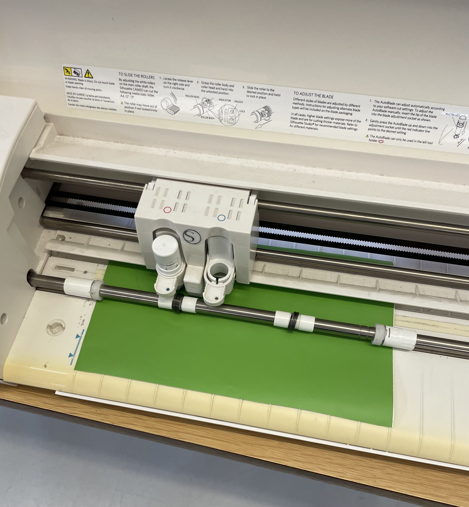

# Nome do Grupo

> Substituam este parágrafo por uma frase de apresentação do grupo (uma linha conceptualmente forte).

## Elementos do Grupo

| Número  | Nome             |
| ------- | ---------------- |
| 2024316 | Adriana Gomes    |
| 2022462 | Daniel Gonçalves |
| 20ZZZZZ | Denilson Correia |
| 20ZZZZ  | Núria            |

---

## Tutoriais de Máquinas

Cada grupo documenta **duas máquinas** com tutoriais detalhados. As páginas individuais de cada tutorial estão em [tutoriais/](tutoriais/).

<!-- Cada thumbnail liga ao tutorial. Cada tutorial vive em
     tutoriais/<nome-da-maquina>/index.md (renomear `_modelo`). -->

<!-- markdownlint-disable MD033 -->

  <a class="gallery-card" href="tutoriais/_modelo/">
    
    <h3>Bambu Lab A1 mini</h3>
    
Tutorial detalhado

  </a>

  <a class="gallery-card" href="tutoriais/_vinilsilhouette/">
    
    <h3>Cortadora de Vinil Silhouette</h3>
    
Tutorial detalhado

  </a>

<!-- markdownlint-enable MD033 -->

---

## Galeria de Experiências Individuais

Cada elemento do grupo desenvolveu um portfólio individual (**Projeto Integrado**, 50% da avaliação). As páginas individuais estão em [experiencias/](experiencias/).

<!-- Duplicar o bloco abaixo para cada elemento e substituir `_modelo` em
     ambos os caminhos por `<numero>-<nome>`. -->

<!-- markdownlint-disable MD033 -->

  <a class="gallery-card" href="Projeto Individual - Adriana/_modelo_Adriana/">
    
    <h3>Nexo</h3>
    
Adriana Gomes

  </a>
  <a class="gallery-card" href="Projeto Individual - Daniel/_modelo_Daniel/">
    
    <h3>Dois em UM</h3>
    
Daniel Gonçalves

  </a>
    <a class="gallery-card" href="Projeto Individual - Denilson/_modelo_Denilson/">
    
    <h3>Suporte de Headphones</h3>
    
Denilson Correia

  </a>
    <a class="gallery-card" href="Projeto Individual - Nuria/_modelo_Nuria/">
    
    <h3>Birdie Vase</h3>
    
Núria

<!-- markdownlint-enable MD033 -->
